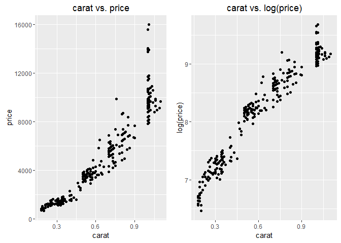
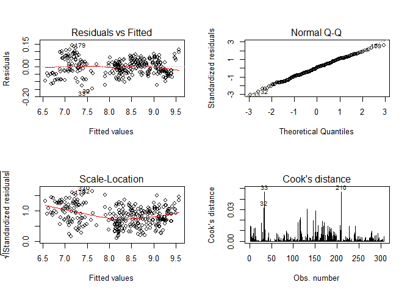
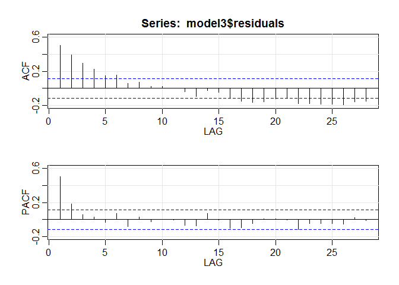

Statistical Regression Analysis
================

Introduction
------------

The diamonds dataset contains the prices and other attributes such as the caratage, clarity or colour of 308 stones. The goal of this project is to come up with a Multiple Linear Regression model and compare this initial model against different solutions to improve the initial simple approach.

``` r
library(ggplot2)
library(gridExtra)
library(car)
library(lmtest)
library(tseries)
library(astsa)
library(nlme)
```

``` r
# Loading the dataset into a DataFrame.
df <- read.table("../data/HW-diamonds.txt", quote="\"", comment.char="")
colnames(df) <- c("carat", "color", "clarity", "institution", "price")

observations = nrow(df)
variables = ncol(df)
sprintf("observations: %s and variables: %s", observations, variables)
```

    ## [1] "observations: 308 and variables: 5"

Logarithmic transformation
--------------------------

When a linear regression study is performed, it is a good practice to transform some of the original variables if we could not achieve linearity formerly. The logarithmic transformation is one of the most popular. This transformation is commonly used to induce symmetry and linearity when the original data is non-linear and its variance is not constant and increases along the x-axis. For instance, compare the two plots of the below Figure, where the weight of the diamond is plotted against its original price. In the left-handed plot, the variance concentrated around 0.3 is significantly smaller than around 1, and besides the trend does not seem linear. On the other hand, if we consider the log(price), the plot looks linearly nicer.

``` r
# carat vs. log(carat).
p1 <- ggplot(df, aes(x=carat, y=price))+geom_point()+ ggtitle('carat vs. price') 
p2 <- ggplot(df, aes(x=carat, y=log(price)))+geom_point() + ggtitle('carat vs. log(price)')
grid.arrange(p1, p2, ncol=2)
```



From now on, we will consider as response variable the <b>log(price)</b>. However, notice that the interpretation of the analysis will be notably different since we are not considering the original measure.

Multiple Linear Regression
--------------------------

We will start by performing a simple linear analysis for pricing the diamonds based on the caratage, colour purity, clarity and institution.

First of all, we will re-level some of the categorical variables as the reference category. Concretely, the new references categories will be I in colour, VS2 in clarity and HRD in institution.

``` r
# Releveling factors.
df$color=relevel(df$color, ref="I")
df$clarity=relevel(df$clarity, ref="VS2")
df$institution=relevel(df$institution, ref="HRD")
```

Then, we fit the linear model using the mentioned variables. In the log-linear model, the interpretation of the estimated coefficient  is that a one-unit increase in  will produce and expected increase in  of  units. The parameters for the fitted model and the fitted line are the following:

``` r
# Simple linear regression model.
model1 = lm(log(price)~carat+color+clarity+institution, data=df)
summary(model1)
```

    ## 
    ## Call:
    ## lm(formula = log(price) ~ carat + color + clarity + institution, 
    ##     data = df)
    ## 
    ## Residuals:
    ##      Min       1Q   Median       3Q      Max 
    ## -0.31236 -0.11520  0.01613  0.10833  0.36339 
    ## 
    ## Coefficients:
    ##                 Estimate Std. Error t value Pr(>|t|)    
    ## (Intercept)     6.077239   0.048091 126.369  < 2e-16 ***
    ## carat           2.855013   0.036968  77.230  < 2e-16 ***
    ## colorD          0.416557   0.041382  10.066  < 2e-16 ***
    ## colorE          0.387047   0.030824  12.557  < 2e-16 ***
    ## colorF          0.310198   0.027479  11.288  < 2e-16 ***
    ## colorG          0.210207   0.028359   7.412 1.32e-12 ***
    ## colorH          0.128681   0.028523   4.511 9.31e-06 ***
    ## clarityIF       0.298541   0.033303   8.964  < 2e-16 ***
    ## clarityVS1      0.096609   0.024919   3.877  0.00013 ***
    ## clarityVVS1     0.297835   0.028102  10.598  < 2e-16 ***
    ## clarityVVS2     0.201923   0.025344   7.967 3.56e-14 ***
    ## institutionGIA  0.008856   0.020864   0.424  0.67155    
    ## institutionIGI -0.173855   0.028673  -6.063 4.07e-09 ***
    ## ---
    ## Signif. codes:  0 '***' 0.001 '**' 0.01 '*' 0.05 '.' 0.1 ' ' 1
    ## 
    ## Residual standard error: 0.1382 on 295 degrees of freedom
    ## Multiple R-squared:  0.9723, Adjusted R-squared:  0.9712 
    ## F-statistic: 863.6 on 12 and 295 DF,  p-value: < 2.2e-16

From the interpretation of the coefficients, we can discuss several aspects related to the model meaning and significance:

-   <b>Most influential variable: carat</b>. The carat is the most dominant variable in the price of the diamonds. An increase in 1 unit of carat implies an increase in  of the mean price or, talking in diamond's dimensions, for an increase in caratage of 0.01, the mean price of a diamond increases 1.029.

-   <b>Colour and clarity ranking</b>. As expected, the better is the colour purity or the clarity, the higher will be the price. For example, colour D is the top colour purity and boosts the price of the diamonds a 50% more than the worst colour (I).

-   <b>Marginal tests and institution variable</b>: Each of the coefficient has a marginal test which attempts the null hypothesis , after adjusting the other coefficients within the model. That means, it is checked the net effect of each variable and whether should be in the model or not. All these p-values are small enough to reject  considering the usual significance level 0.05, except the one for institutionGIA (p-value = 0.672). We do not have evidence against the null hypothesis and hence this coefficient contributes the same as the reference category HRD to the mean price. This category could be discarded in further analysis, for instance, combining GIA and HRD into one single category. Furthermore, these two categories are the best institutions since the diamonds certificated by IGI decrease the mean price in a 16%.

-   <b>Regression overall test</b>. The p-value of the overall test for the significance of the regression model is considerably small and hence this model would explain better the data than the simple mean model.

-   <b>Multiple R-squared</b>. The Multiple R-squared measures the percentage of the variation in Y that is explained by the regression model, in this case, 97%.

Let us perform a basic analysis of the residuals to check if the LINE conditions are fulfilled and let us try to detect which might be the factors that do not meet such conditions:

``` r
# Residuals
par(mfrow=c(2,2))
plot(model1, which=c(1:4), ask=F)
```


-   <b>Linearity</b>: Since we are working with a multiple linear regression model in high dimensions, we cannot graphically check the linearity of the model and we will perform the Rainbow test for linearity (package <i>lmtest</i>).

``` r
# Rainbow test
raintest(model1)
```

    ## 
    ##  Rainbow test
    ## 
    ## data:  model1
    ## Rain = 0.69098, df1 = 154, df2 = 141, p-value = 0.9875

A p-value near to 1 shows the linear relationship between the response and the linear predictor.

-   <b>Independence of residuals</b>: Observing the residuals vs. the fitted values, an evident parabolical pattern can be identified and hence the residuals are not independent. Performing the Durbin-Watson test checking the null hypotheses that the autocorrelation of the residuals is 0, the low p-value confirms the strong evidence to reject .

``` r
# Independence of residuals.
dwtest(model1, alternative="two.sided")
```

    ## 
    ##  Durbin-Watson test
    ## 
    ## data:  model1
    ## DW = 0.31422, p-value < 2.2e-16
    ## alternative hypothesis: true autocorrelation is not 0

-   <b>Constant variance</b>: The variance does not look constant along the axis, but it is difficult to ensure it at a first glimpse. The Breusch-Pagan test against heteroskedasticity affirms this assumption (p-value  0).

``` r
# Constant variance.
bptest(model1)
```

    ## 
    ##  studentized Breusch-Pagan test
    ## 
    ## data:  model1
    ## BP = 47.223, df = 12, p-value = 4.265e-06

-   <b>Normality of residuals</b>: At a first glimpse, the Normal Q-Q plot seems correct and the residuals might follow a normal distribution. However, the Jarque Bera test for normality also rejects the null hypothesis but with a moderate p-value (0.01175) compared to the regular significance level of 0.05.

``` r
# Normality
df <- dplyr::mutate(df, resid=residuals(model1), fv=fitted(model1), predwage=exp(fv)) 
jarque.bera.test(df$resid)
```

    ## 
    ##  Jarque Bera Test
    ## 
    ## data:  df$resid
    ## X-squared = 8.0626, df = 2, p-value = 0.01775

-   <b>Outliers</b>: Analysing the Cook's distance some noticeable outliers are detected (110, 223 and 214). The first one has an usual price (9885) compared to its carat. The mean price for carats between 0.5 and 1 is 4945. The further two were certificated by the IGI institution but have an unexpected high price. The previous hypothesis about the drop of the price in such institution is not met in these cases.

To conclude, if we plot the residuals of the carat variable against the fitted values, we would observe that it may need a quadratic term. The Tukey's test for non-additivity computes a curvature test by adding a quadratic term and testing the quadratic to be zero.

Remedial actions
----------------

We will include two different remedial actions in order to improve the validation of model and to check if the LINE assumptions can be met. However, the independence of the residuals will not be solved, and a new method is proposed at the end of the script to deal with this problem: Generalized Least Square.

### Clustering diamonds by carat

The first remedial action which has been tested is to create a new categorical variable, carat2, which divides diamonds in three groups depending on their caratage. This way, they can either belong to the small (carat &lt; 0.5), medium () or large (\[\]<https://latex.codecogs.com/gif.latex?%24carat%20%5Cgeq%201%24>) categories.

``` r
# Discretizing and releveling factors.
df$carat2 <- df$carat
df$carat2[df$carat < 0.5] <- "small"
df$carat2[df$carat >= 0.5 & df$carat < 1] <- "medium"
df$carat2[df$carat >= 1] <- "large"
df$carat2 <- as.factor(df$carat2)

df$carat2=relevel(df$carat2, ref="small")
```

A new model has been adjusted taking into account this new variable, as well as its interaction term with the already existing carat. The parameters of the fitted model can be seen below:

``` r
# Linear model with clusters.
model2 = update(model1, ~.+carat2+carat:carat2)
summary(model2)
```

    ## 
    ## Call:
    ## lm(formula = log(price) ~ carat + color + clarity + institution + 
    ##     carat2 + carat:carat2, data = df)
    ## 
    ## Residuals:
    ##       Min        1Q    Median        3Q       Max 
    ## -0.162232 -0.036601  0.003364  0.039892  0.140706 
    ## 
    ## Coefficients:
    ##                     Estimate Std. Error t value Pr(>|t|)    
    ## (Intercept)         5.530676   0.032878 168.218  < 2e-16 ***
    ## carat               4.257150   0.085503  49.790  < 2e-16 ***
    ## colorD              0.433562   0.016897  25.659  < 2e-16 ***
    ## colorE              0.348679   0.012550  27.784  < 2e-16 ***
    ## colorF              0.272843   0.011142  24.488  < 2e-16 ***
    ## colorG              0.187887   0.011522  16.307  < 2e-16 ***
    ## colorH              0.107866   0.011481   9.395  < 2e-16 ***
    ## clarityIF           0.311385   0.013543  22.992  < 2e-16 ***
    ## clarityVS1          0.068240   0.010060   6.783 6.56e-11 ***
    ## clarityVVS1         0.213344   0.011536  18.493  < 2e-16 ***
    ## clarityVVS2         0.134180   0.010351  12.963  < 2e-16 ***
    ## institutionGIA      0.007703   0.008473   0.909    0.364    
    ## institutionIGI     -0.016726   0.012177  -1.374    0.171    
    ## carat2large         2.376272   0.319800   7.430 1.21e-12 ***
    ## carat2medium        0.946026   0.039091  24.201  < 2e-16 ***
    ## carat:carat2large  -3.259971   0.323445 -10.079  < 2e-16 ***
    ## carat:carat2medium -1.765492   0.093498 -18.883  < 2e-16 ***
    ## ---
    ## Signif. codes:  0 '***' 0.001 '**' 0.01 '*' 0.05 '.' 0.1 ' ' 1
    ## 
    ## Residual standard error: 0.0554 on 291 degrees of freedom
    ## Multiple R-squared:  0.9956, Adjusted R-squared:  0.9954 
    ## F-statistic:  4127 on 16 and 291 DF,  p-value: < 2.2e-16

It is worth noting that, similar to what happened with the previous model, the p-values for both institutionGIA and institutionIGI are not low enough for us to have evidence to reject the null hypothesis. Therefore, the whole categorical variable could be left out in further analysis, as they do not suppose any variation in the price of the diamonds.

On the other hand, the overall p-value for the whole model is still low, showing that the proposed model is satisfactory. Moreover, the Multiple R-squared coefficient has slightly improved up to 99:56%. To check if the standard assumptions are met, an analysis of the residuals has been performed:

``` r
# Residuals
par(mfrow=c(2,2))
plot(model2, which=c(1:4), ask=F)
```



-   <b>Linearity</b>: As in the previous model, the Rainbow test for linearity has been conducted. The obtained p-value, 0.94, reflects the linear relationship between the linear predictor and the response variable.

``` r
# Rainbow test
raintest(model2)
```

    ## 
    ##  Rainbow test
    ## 
    ## data:  model2
    ## Rain = 0.7763, df1 = 154, df2 = 137, p-value = 0.9366

-   <b>Independence of residuals</b>: The residuals vs. fitted values plot has considerably improved and is now closer to being flat. However, performing the Durbin-Watson test reveals that there is strong evidence to reject , so the conclusion is that residuals are not independent.

``` r
# Independence of residuals.
dwtest(model2, alternative="two.sided")
```

    ## 
    ##  Durbin-Watson test
    ## 
    ## data:  model2
    ## DW = 1.0398, p-value < 2.2e-16
    ## alternative hypothesis: true autocorrelation is not 0

-   <b>Constant variance</b>: The Breusch-Pagan test has been conducted to check heteroskedasticity, and the resulting p-value, very close to 0, confirms that the variance of these residuals is also not constant.

``` r
# Constant variance.
bptest(model2)
```

    ## 
    ##  studentized Breusch-Pagan test
    ## 
    ## data:  model2
    ## BP = 60.618, df = 16, p-value = 4.117e-07

-   <b>Normality of residuals</b>: Judging by the Normal Q-Q plot, residuals seem to be normally distributed. To confirm this hypothesis, the Jarque Bera test has been conducted. The test returns a high p-value, showing that residuals are indeed normal. This condition is now met, in contrast to the first model.

``` r
# Normality.
df <- dplyr::mutate(df, resid=residuals(model2), fv=fitted(model2), predwage=exp(fv)) 
jarque.bera.test(df$resid)
```

    ## 
    ##  Jarque Bera Test
    ## 
    ## data:  df$resid
    ## X-squared = 1.3424, df = 2, p-value = 0.5111

#### Interpreting the interaction parameter (clusters.)

At first sight, the interaction parameter seems confusing, given that both carat\*carat2medium (-1.76) and carat\*carat2large (-3.26) are negative. We would expect that the higher is the carat, the higher is its price. However, there is a clear interpretation for this fact: the variation in diamond price when carat is increased or decreased by one unit is different for each of the clusters. A small variation in caratage results in a much higher variation in price for diamonds belonging to the small cluster, while it does not make such a big difference for heavier diamonds, especially those which belong to the large cluster. Putting it in numbers, the difference of price increment between carats of 0.30 and 0.35 is much higher than carats of 1 and 1.05.

### Square of carat

A second approach to remedial actions has been to include the square of carat as a new explanatory variable, which avoids the subjectivity of clusters definition. The new fitted model has the following parameters:

``` r
# Linear model with centered square of carat.
model3 = update(model1, ~.+I(scale(carat, scale = F)^2))
summary(model3)
```

    ## 
    ## Call:
    ## lm(formula = log(price) ~ carat + color + clarity + institution + 
    ##     I(scale(carat, scale = F)^2), data = df)
    ## 
    ## Residuals:
    ##      Min       1Q   Median       3Q      Max 
    ## -0.15411 -0.04120 -0.00911  0.04543  0.14158 
    ## 
    ## Coefficients:
    ##                               Estimate Std. Error t value Pr(>|t|)    
    ## (Intercept)                   6.143399   0.020682 297.043  < 2e-16 ***
    ## carat                         3.017111   0.016455 183.350  < 2e-16 ***
    ## colorD                        0.442606   0.017742  24.947  < 2e-16 ***
    ## colorE                        0.363359   0.013220  27.485  < 2e-16 ***
    ## colorF                        0.286615   0.011789  24.311  < 2e-16 ***
    ## colorG                        0.197573   0.012153  16.257  < 2e-16 ***
    ## colorH                        0.103508   0.012238   8.458 1.30e-15 ***
    ## clarityIF                     0.320183   0.014279  22.424  < 2e-16 ***
    ## clarityVS1                    0.075713   0.010690   7.083 1.05e-11 ***
    ## clarityVVS1                   0.226174   0.012199  18.540  < 2e-16 ***
    ## clarityVVS2                   0.143481   0.010976  13.072  < 2e-16 ***
    ## institutionGIA                0.006223   0.008938   0.696    0.487    
    ## institutionIGI               -0.019190   0.013003  -1.476    0.141    
    ## I(scale(carat, scale = F)^2) -2.102922   0.058022 -36.243  < 2e-16 ***
    ## ---
    ## Signif. codes:  0 '***' 0.001 '**' 0.01 '*' 0.05 '.' 0.1 ' ' 1
    ## 
    ## Residual standard error: 0.0592 on 294 degrees of freedom
    ## Multiple R-squared:  0.9949, Adjusted R-squared:  0.9947 
    ## F-statistic:  4445 on 13 and 294 DF,  p-value: < 2.2e-16

It is advisable to center when you include powers of the same variable to avoid multicollinearity.

In comparison to the previous models, the intercept, as well as the coefficients corresponding to colour, clarity and institution remain almost the same, while the coefficient related to caratage has slightly increased. The newly included term, the square of carat, has a negative coefficient of -2.1. However, as carat is distributed across the sample in the range of 0.18 to 1.1, the influence of this term will mostly be noticeable for diamonds in the upper end of the carat scale. This means, as we had deducted from the previous model, that for an equal increase in carat, smaller diamonds will generally see a higher increase in price than bigger gems. Moreover, the p-value for the overall test is still very low and the Multiple R-squared (0.9949) is slightly worse than the previous model but still larger than the simple one.

The next step is to perform an residuals' analysis to check if the assumptions of the model are met. The linearity and the normality of the residuals are fulfilled, let us check what happens with the independence of residuals and the constant variance:

-   <b>Independence of residuals</b>: Performing the Durbin-Watson test on independence of residuals reveals, once again, that residuals are not independent, as there is strong evidence to reject .

``` r
# Independence of residuals.
dwtest(model3, alternative="two.sided")
```

    ## 
    ##  Durbin-Watson test
    ## 
    ## data:  model3
    ## DW = 0.98039, p-value < 2.2e-16
    ## alternative hypothesis: true autocorrelation is not 0

-   <b>Constant variance</b> Here, this model improves in relation to the preceding ones: the Breusch-Pagan returns a p-value of 0.24, which leads to considering the residuals as homoscedastic.

``` r
# Constant variance.
bptest(model3)
```

    ## 
    ##  studentized Breusch-Pagan test
    ## 
    ## data:  model3
    ## BP = 16.094, df = 13, p-value = 0.2441

Comparison of models
--------------------

If we think in terms of validity of the assumptions, although neither of the models can provide independent residuals, the model including the square of the caratage is slightly better, as it features homoscedastic residuals, which the other one does not.

On the other hand, the model which clusters diamonds according to their weight is easier to interpret, as the results seem more intuitive than the one including an squared term, which is more complex to understand. All in all, it might be a matter of personal preference, but our choice would be the model including clustering. However, this model relies heavily on the definition of the clusters, as it is important to choose the appropriate limits for them. This is a complex task and would require expert knowledge to be carried out properly.

In conclusion, with help from expert knowledge, the clustering model seems to be better; if lacking such advice, it is probably safer to use the other one rather than arbitrarily defining the limits for each group.

Generalized Least Square
------------------------

We have fitted so far three regression models for the diamonds dataset. Let's start with Model 3, which includes carat^2 as an explanatory variable and shows non independent residuals. Let's plot the ACF and PACF of its residuals. The ACF shows an exponential but quick decay and the PACF shows the first two spikes significantly different from 0. This is typical of an AR(2) process.

``` r
# Considering the model as a time series.
acf2(model3$residuals)
```



    ##         ACF  PACF
    ##  [1,]  0.51  0.51
    ##  [2,]  0.39  0.18
    ##  [3,]  0.29  0.05
    ##  [4,]  0.23  0.03
    ##  [5,]  0.15 -0.03
    ##  [6,]  0.16  0.07
    ##  [7,]  0.06 -0.08
    ##  [8,]  0.07  0.03
    ##  [9,]  0.03 -0.03
    ## [10,]  0.02  0.00
    ## [11,]  0.01  0.00
    ## [12,] -0.04 -0.06
    ## [13,] -0.10 -0.08
    ## [14,] -0.03  0.07
    ## [15,] -0.04  0.00
    ## [16,] -0.11 -0.10
    ## [17,] -0.15 -0.09
    ## [18,] -0.17 -0.05
    ## [19,] -0.16  0.01
    ## [20,] -0.12  0.01
    ## [21,] -0.12 -0.01
    ## [22,] -0.18 -0.12
    ## [23,] -0.18 -0.05
    ## [24,] -0.19 -0.04
    ## [25,] -0.19 -0.05
    ## [26,] -0.19 -0.05
    ## [27,] -0.15  0.02
    ## [28,] -0.15 -0.01

The Generalized Least Squares method fits a linear model by relaxing the assumption of homoskedasticity, while all other assumptions remain to hold. That is the case of model 3b, where we have added a square term which improves the constant variance but still remains the correlation of the residuals.

We have fitted a linear model using the R function <i>gls()</i> from the library <i>nlme</i>. The model was fitted by maximizing the log-likelihood and we have added an autoregressive process of order 2 for the residuals, as suggested by the ACF and PACF functions above:

``` r
# Generalized least square model.
model4 = gls(log(price)~carat+color+clarity+institution+I(scale(carat, scale=FALSE)^2), data=df, correlation=corARMA(p=2), method="ML")
summary(model4)
```

    ## Generalized least squares fit by maximum likelihood
    ##   Model: log(price) ~ carat + color + clarity + institution + I(scale(carat,      scale = FALSE)^2) 
    ##   Data: df 
    ##         AIC       BIC   logLik
    ##   -953.8296 -890.4179 493.9148
    ## 
    ## Correlation Structure: ARMA(2,0)
    ##  Formula: ~1 
    ##  Parameter estimate(s):
    ##      Phi1      Phi2 
    ## 0.4265155 0.1914685 
    ## 
    ## Coefficients:
    ##                                      Value  Std.Error   t-value p-value
    ## (Intercept)                       6.138037 0.02837674 216.30523  0.0000
    ## carat                             3.015260 0.02928258 102.97111  0.0000
    ## colorD                            0.459501 0.01380504  33.28502  0.0000
    ## colorE                            0.369874 0.01085932  34.06055  0.0000
    ## colorF                            0.291303 0.00956157  30.46606  0.0000
    ## colorG                            0.207336 0.00987431  20.99751  0.0000
    ## colorH                            0.117548 0.00934105  12.58402  0.0000
    ## clarityIF                         0.314937 0.01167015  26.98656  0.0000
    ## clarityVS1                        0.073162 0.00788219   9.28190  0.0000
    ## clarityVVS1                       0.219022 0.00923433  23.71828  0.0000
    ## clarityVVS2                       0.138785 0.00826640  16.78900  0.0000
    ## institutionGIA                    0.004709 0.01782139   0.26421  0.7918
    ## institutionIGI                   -0.029509 0.02403721  -1.22763  0.2206
    ## I(scale(carat, scale = FALSE)^2) -2.033315 0.11445045 -17.76590  0.0000
    ## 
    ##  Correlation: 
    ##                                  (Intr) carat  colorD colorE colorF colorG
    ## carat                            -0.745                                   
    ## colorD                           -0.206  0.075                            
    ## colorE                           -0.320  0.101  0.469                     
    ## colorF                           -0.364  0.128  0.466  0.643              
    ## colorG                           -0.329  0.111  0.459  0.598  0.688       
    ## colorH                           -0.290  0.064  0.414  0.557  0.634  0.634
    ## clarityIF                        -0.256  0.111  0.106  0.157  0.171  0.072
    ## clarityVS1                       -0.184  0.027 -0.016 -0.009  0.008  0.027
    ## clarityVVS1                      -0.275  0.083  0.023  0.109  0.026  0.006
    ## clarityVVS2                      -0.217  0.018  0.011  0.067  0.067 -0.018
    ## institutionGIA                   -0.523  0.139  0.002  0.038  0.052  0.042
    ## institutionIGI                   -0.603  0.537  0.028  0.032  0.035  0.042
    ## I(scale(carat, scale = FALSE)^2) -0.003 -0.347 -0.035  0.039  0.042  0.031
    ##                                  colorH clrtIF clrVS1 clVVS1 clVVS2 insGIA
    ## carat                                                                     
    ## colorD                                                                    
    ## colorE                                                                    
    ## colorF                                                                    
    ## colorG                                                                    
    ## colorH                                                                    
    ## clarityIF                         0.050                                   
    ## clarityVS1                        0.056  0.434                            
    ## clarityVVS1                       0.025  0.489  0.513                     
    ## clarityVVS2                       0.022  0.512  0.589  0.573              
    ## institutionGIA                    0.035  0.061 -0.016  0.111  0.057       
    ## institutionIGI                    0.052 -0.065 -0.023  0.023 -0.031  0.521
    ## I(scale(carat, scale = FALSE)^2)  0.026 -0.032  0.005  0.029  0.020 -0.033
    ##                                  insIGI
    ## carat                                  
    ## colorD                                 
    ## colorE                                 
    ## colorF                                 
    ## colorG                                 
    ## colorH                                 
    ## clarityIF                              
    ## clarityVS1                             
    ## clarityVVS1                            
    ## clarityVVS2                            
    ## institutionGIA                         
    ## institutionIGI                         
    ## I(scale(carat, scale = FALSE)^2) -0.399
    ## 
    ## Standardized residuals:
    ##        Min         Q1        Med         Q3        Max 
    ## -2.6203119 -0.6670708 -0.1234453  0.7625326  2.4197585 
    ## 
    ## Residual standard error: 0.05833938 
    ## Degrees of freedom: 308 total; 294 residual

The following table compare the distinct AIC values of the models that we have analysed along the document. Notice that the lower the value, the better the model. The GLS model has the best accuracy.

<table align="center" style="margin: 0px auto;" class="tg">
<tr>
    <th class="tg-031e"></th>
    <th class="tg-031e">AIC</th>

</tr>
<tr>
    <td class="tg-031e">model1</td>
    <td class="tg-031e">-330.31</td>

</tr>
<tr>
    <td class="tg-031e">model2</td>
    <td class="tg-031e">-889.58</td>

</tr>
<tr>
    <td class="tg-031e">model3</td>
    <td class="tg-031e">-851.57</td>

</tr>
<tr>
    <td class="tg-031e">model4</td>
    <td class="tg-031e">-945.06</td>

</tr>
</table>
